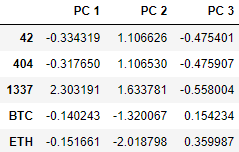
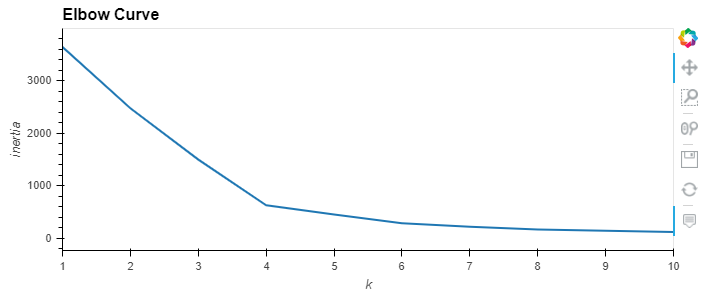
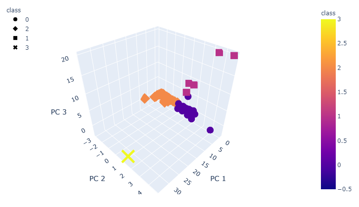
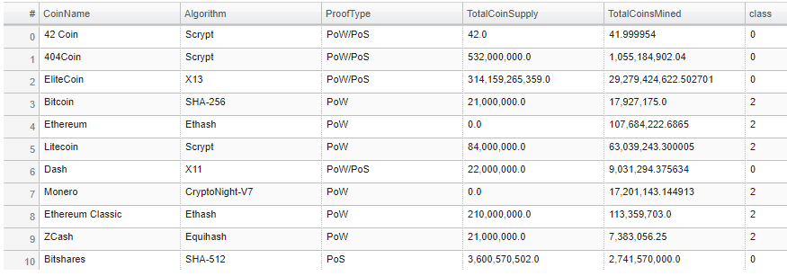
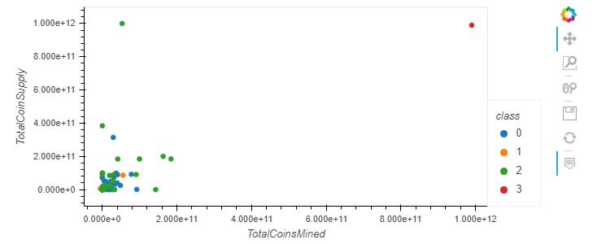

# Module 18 Challenge - Unsupervised Machine Learning & Cryptocurrency

## Challenge Overview

The goals for this challenge are to present what cryptocurrencies are on the trading market and how cryptocurrencies could be grouped toward creating a classification for further analysis:

- Prepare the data for dimensions reduction with PCA and clustering using K-means.
- Reduce data dimensions using PCA algorithms from sklearn.
- Predict clusters using cryptocurrencies data using the K-means algorithm from sklearn.
- Create some plots and data tables to present your results.

## Resources

Data Sources: [crypto_data](Resources/crypto_data.csv)

Software: Python (libraries: pandas, hvplot, plotly, and sklearn), Juptyer Notebook

## Results

**Reduced Data Dimensions Using PCA**

**Clustering Cryptocurrencies Using K-Means - Elbow Curve**

**3D Scatter Plot**

**Data Table - All Current Tradable Cryptocurrencies.**

**2D Scatter Plot**

## Report completed by:

